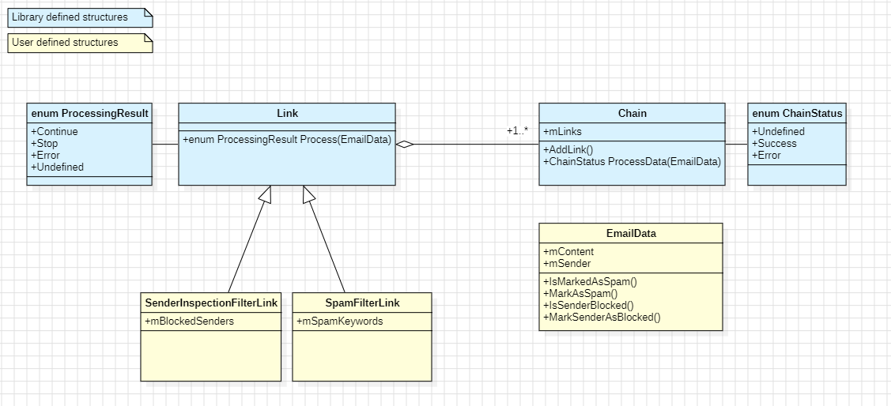

# chain-of-responsibility

## Brief  
Library that implements C++ "Chain Of Responsibility" design pattern template.  

## Example
### Email processing example
In this example, email processing chain consists of two links.  
The first link checks if given email in spam.  
The second link checks if given email sender is blocked.

The following UML describes this example:

